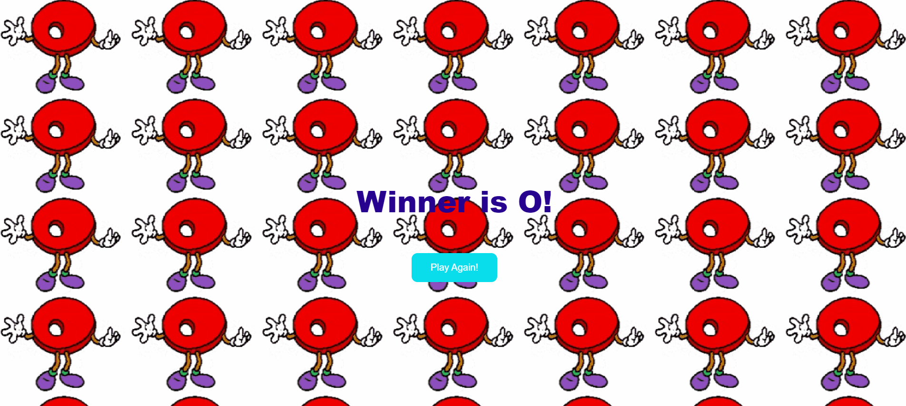
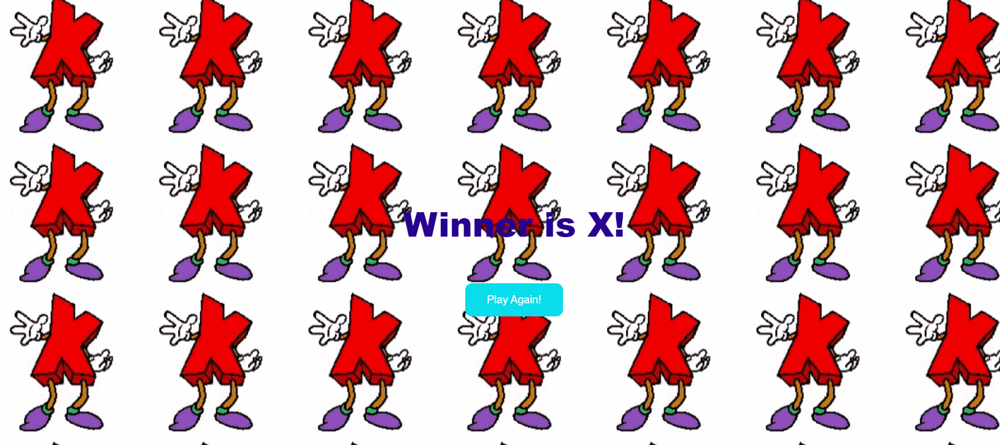
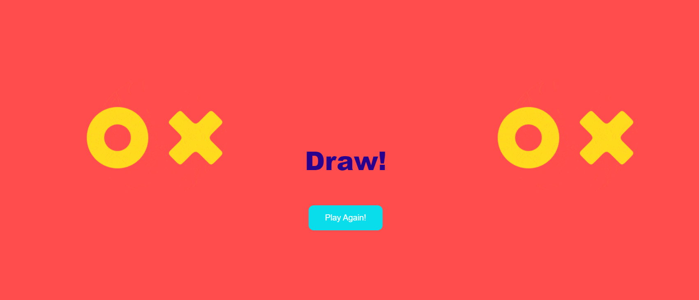
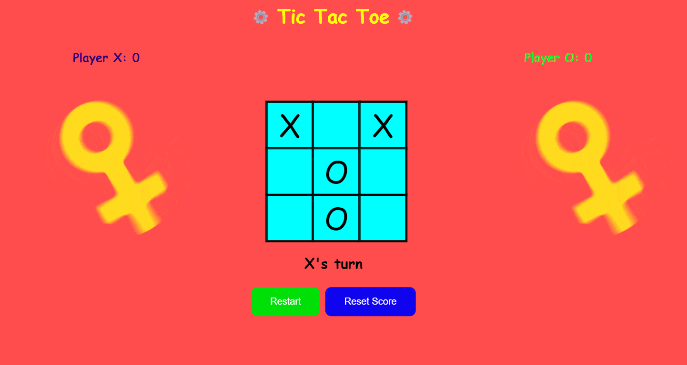
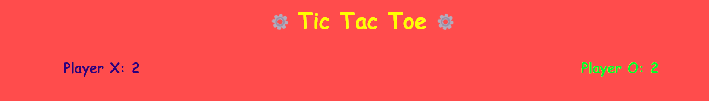

## LOGISTICS FOR TIC TAC TOE game

Documentation for the implementation of my Tic Tac Toe game using HTML, CSS and Javascript.

## Abstract 
This is a game of TIC TAC TOE when 2 players play against each other and have a respective score.

The files can be described as follows.
- `function.js` is a file containing the logic and functions of the game.
- `xo.html` creates the front-end of the game.
- `xostyle.css` is a file that specifies the fonts, colors, bacgrounds, transitions use for the game.

## Colors and Fonts

### Fonts:
- "Permanent Marker", cursive.
- 'Arial', sans-serif

### Colors
-	 Reset Score button: Blue;
-	 Reset game over button: Pale Green
- 	Grid: Pale blue
-	 Player 1: Purple
-	 Player 2: Green

### Qualitative 

In this section we show the qualitative results of our experiment. 

#### WINS

-  When Player X wins, a message is shown on the screen with a dancing X gif as background.
-	 When Player O wins, a message is shown on the screen with a dancing O gif as background.

  
  
  (a) When Player O wins.
  (b) When Player X wins.

#### DRAW

  

<b>When there is a DRAW!</b> 

### Quantitative

In this section we show the quantitative results of our experiment. 

  

<b>We can see above how the game looks like while playing.</b>

  

<b>As the players win, their respective score is incremented.</b>

